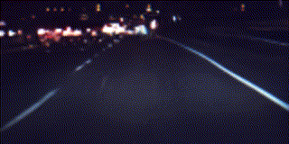

# Drive Simulator
Follow the instructions to train a generative model as described by
[Learning a Driving Simulator](http://arxiv.org/abs/1608.01230).

1) Download dataset
```
./get_data.sh
```

2) Start data server in the first terminal session
```bash
./server.py --batch 64
```
For maximum performance we recommend using tmux. screen is not good.  
3) Train auto encoder in the second terminal
```bash
./train_generative_model.py autoencoder --batch 64
```
This will create two folders called `outputs/results_autoencoder` with model checkpoints
and `outputs/samples_autoencoder` with samples from the generative model. In the sampled
images odd columns are generated and even column images are target images.  

Once the autoencoder model is trained you can stop the previous server and
start training the transition model

4). Run server for transition model
```bash
./server.py --time 60 --batch 64
```

5) Train transition model
```bash
./train_generative_model.py transition --batch 64 --name transition
```
This will create two folders called `outputs/results_transition` with model checkpoints
and `outputs/samples_transition` with samples from the generative model

Training logs will be saved to `/tmp/logs/<model_name>`. You can visualize
logs using Tensorboard by typing
`tensorboard --logdir /tmp/logs/autoencoder` or  
`tensorboard --logdir /tmp/logs/transition`

6) Make a gif of the transition model
```bash
./view_generative_model.py transition --name transition
```


Here your job is to make the video look so great that it could be used train a steering angle model.
